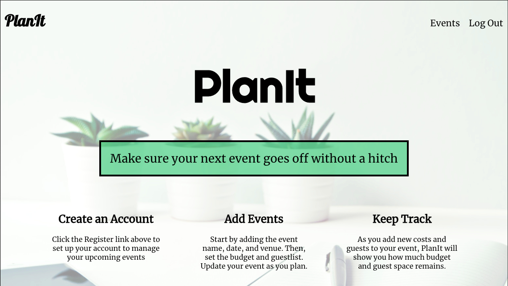
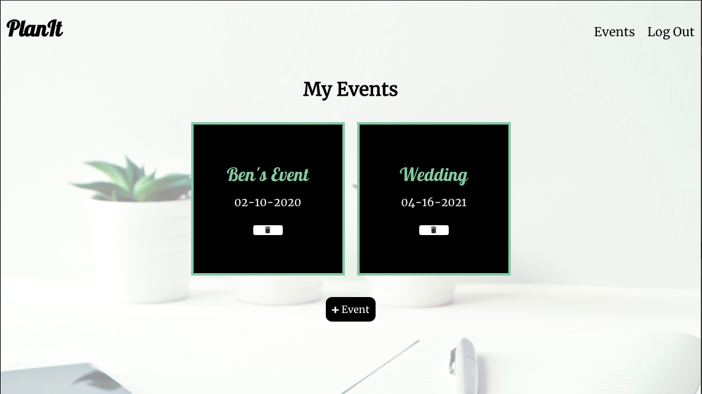
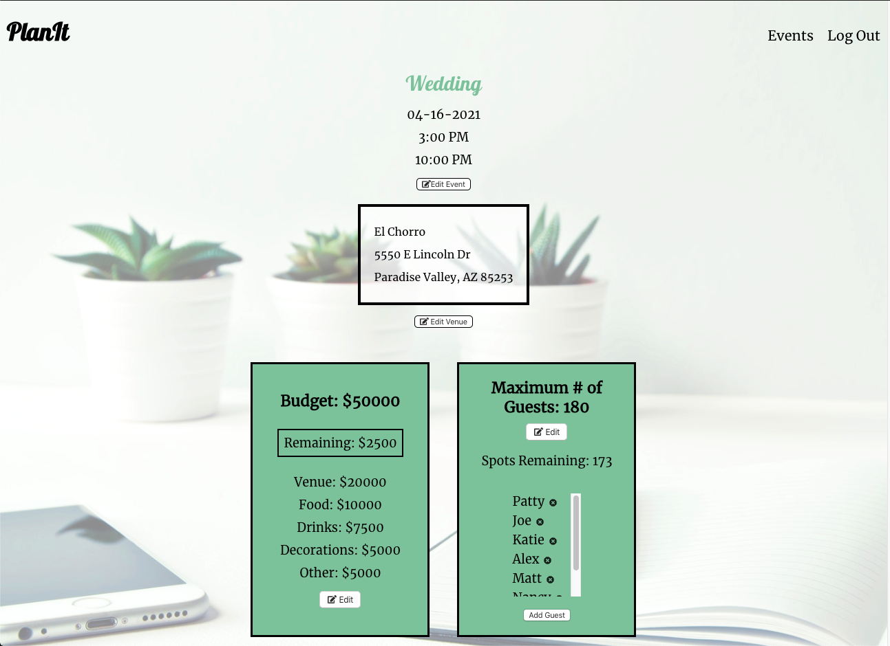
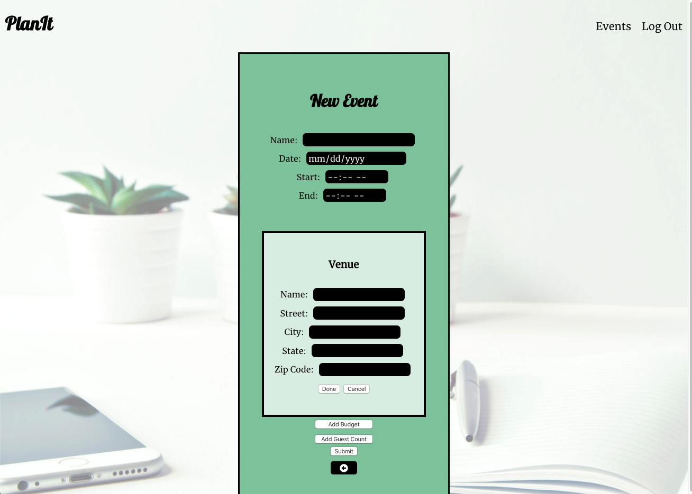
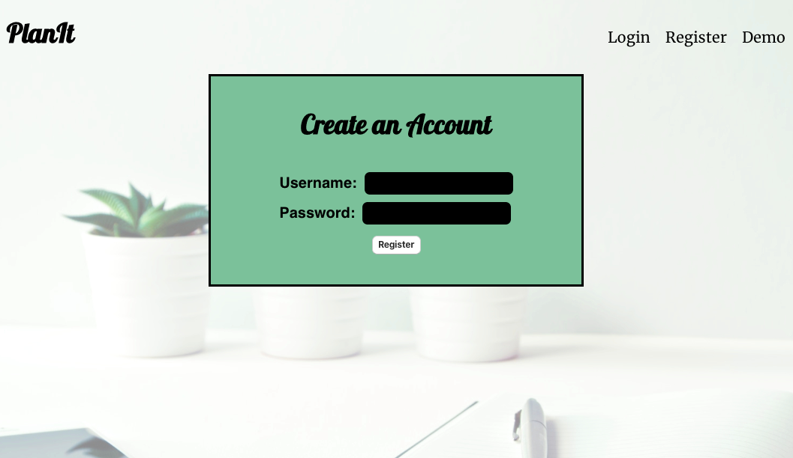

# PlanIt

Link to Live App: https://plan-it.now.sh/

## PlanIt is a full-stack web based application that allows users to create an account and plan events like Weddings, Bachelor Parties, and more. 

 Users can login to view their Events, update the date & time, add a venue, manage the budget, and add guests to the guest list. They can also create new events and enter any known information, and add additional information at a later time. 

 ## Technology Used
 <ul>
    <li>HTML5</li>
    <li>CSS3</li>
    <li>React.js</li>
    <li>Node.js</li>
    <li>Express</li>
    <li>PostgreSQL</li>
 </ul>

 ### Home Page
 

 ### My Events
 

 ### Event Page
 

 ### New Event
 

 ### Registration
 